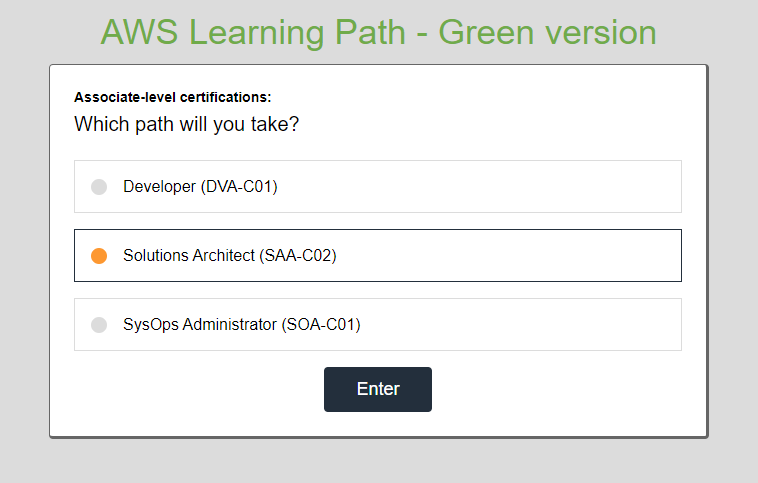
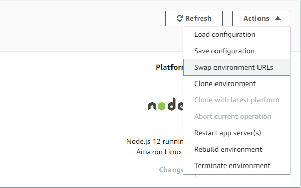
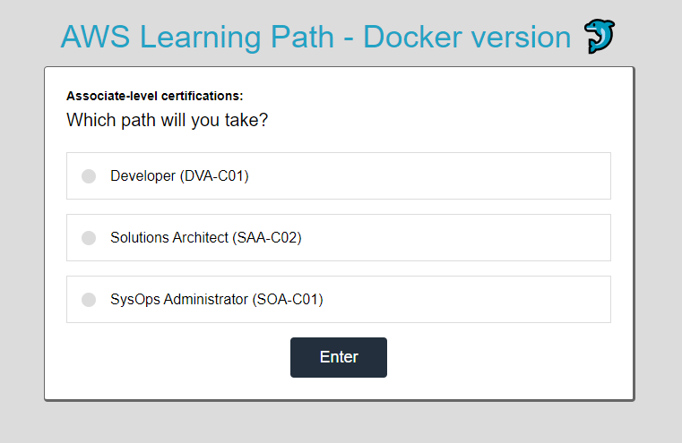
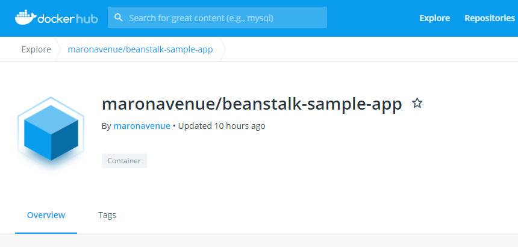

# Let's mess around with Elastic Beanstalk :seedling:


## Prologue
This repo houses a simple `Node` web app using [Mithril JS](expressjs.com/en/starter/hello-world.html) and [Express JS](https://expressjs.com/en/starter/hello-world.html) for the frontend and backend pieces. You should be able to read along the code and easily pick up what going on. We'll use this app to play around Beanstalk.

## What you'll learn
  * Build an `Elastic Beanstalk` **application** and create multiple **environments** for your dev workflow
  * Deploy new versions into your environments using `mutable` and `immutable` **deployment policies**
  * Learn and perform `Blue-Green deployment`
  * Containerize your app using `Docker`
  * Deploy a **containerized app** in two ways:
    1. via image based from a `Dockerfile` (local)
    1. via image hosted on `Docker Hub` (remote)

## Setting up
  1. Configure your AWS credentials locally including the necessary IAM policies for `Elastic Beanstalk`.
  1. Install `EB CLI` by following [the official guide](https://github.com/aws/aws-elastic-beanstalk-cli-setup).
  1. Install `Docker` (used `v19.03.12`) in your Host OS by following [the official guide](https://docs.docker.com/get-docker/).
  1. Install `Node` (used `v14.15.0`) in your [machine](https://nodejs.org/en/download/) or run a [Docker container](https://hub.docker.com/_/node), whichever is fine.
  1. Clone [this repo](https://github.com/maronavenue/elastic-beanstalk-sample-app) and get into the root directory. Make sure you're in the default branch: `main`.

## Let's get started
Time to get our hands dirty! :clap:

### Step 0. Test sample app locally
Just to make sure things are going smoothly, run the app locally. Set `PORT=8080` env var then simply run `npm start`. Check your browser: http://localhost:8080/
```bash
(main) $ export PORT=8080
(main) $ npm start
start ./elastic-beanstalk-sample-app
node index.js

Sample app listening on port 8080...
```
**Tip:** For `Windows` users, set the env var using `$env:PORT=8080`.

### Step 1. Initialize your app from the root work directory
In the `main` branch, initialize the app using `eb init`. Select the appropriate **region** and **platform** (`Node.js`). Skip `CodeCommit` and `SSH settings`. We don't need them in this hands-on.
<br />
We can use the default name: `"elastic-beanstalk-sample-app"`.
```bash
(main) $ eb init
Select a default region
(default is 3):


Enter Application Name
(default is "elastic-beanstalk-sample-app"):
Application elastic-beanstalk-sample-app has been created.

It appears you are using Node.js. Is this correct?
(Y/n): Y
Select a platform branch.
1) Node.js 12 running on 64bit Amazon Linux 2
2) Node.js 10 running on 64bit Amazon Linux 2
3) Node.js running on 64bit Amazon Linux
(default is 1):

Do you wish to continue with CodeCommit? (Y/n): n
Do you want to set up SSH for your instances?
(Y/n): n
```
You will notice right away that it just generated an internal file: `/.elasticbeanstalk/config.yml`. It will use this local config throughout your dev workflow cycle. It doesn't create any resources for `Elastic Beanstalk` yet.

### Step 2. Create your first environment
Time to create your **first environment**. By default, `eb create` will prompt you to create a `LoadBalanced` environment with these settings:
  * `Elastic Load Balancer` - fronts your app to receive all the client requests and forwards them to your instances
  * `Auto-scaling Group` - maintains `1:1:4` (desired:min:max) to keep it running and handle spikes to an extent

**_We don't need that_**. Let's just spin up a single EC2 instance to minimize costs using `--single`. To further keep them down, run a very cheap instance such as `t2.micro` especially if you're **Free Tier** eligible.

Let's call it `"elastic-beanstalk-sample-app-blue"` for now (_you'll find out later_).
```bash
(main) $ eb create --single --instance-types t2.micro
Enter Environment Name
(default is elastic-beanstalk-sample-app-dev): elastic-beanstalk-sample-app-blue
Enter DNS CNAME prefix
(default is elastic-beanstalk-sample-app-blue):

Would you like to enable Spot Fleet requests for this environment? (y/N): N
Creating application version archive "app-08a3-201129_010920".
Uploading elastic-beanstalk-sample-app/app-08a3-201129_010920.zip to S3. This may take a while.
Upload Complete.
Environment details for: elastic-beanstalk-sample-app-blue
  Application name: elastic-beanstalk-sample-app
  Region: your-region
  # Truncated...
Printing Status:
2020-11-28 17:09:24    INFO    createEnvironment is starting.
# Truncated...
2020-11-28 17:11:07    INFO    Waiting for EC2 instances to launch. This may take a few minutes.
2020-11-28 17:11:10    INFO    Instance deployment: You didn't specify a Node.js version in the 'package.json' file in your source bundle. The deployment didn't install a specific Node.js version.
2020-11-28 17:11:16    INFO    Instance deployment completed successfully.
```
Notice that it still created an `Auto-scaling Group` but with `1:1:1` capacity settings just to guarantee that the single instance is **_always up and running_** for us. Cool, isn't it?  
##### Warning :warning:
This will **incur small charges** to your AWS account if you're not **Free Tier** eligible.

### Step 3. Verify your environment
Monitor the deployment using `eb status`. Pay attention to **Status** and **Health** as they should indicate if the it has completed successfully.

You can also check it interactively through the `EB Console`. There are also tons of information available about the environment such as **Events** and **Logs**.
```bash
(main) $ eb status
Environment details for: elastic-beanstalk-sample-app-blue
  Application name: elastic-beanstalk-sample-app
  # Truncated...
  Status: Ready
  Health: Green

(main) $ eb events

2020-11-28 17:09:24    INFO    createEnvironment is starting.
# Truncated...
2020-11-28 17:11:16    INFO    Instance deployment completed successfully.
2020-11-28 17:11:48    INFO    Application available at elastic-beanstalk-sample-app-blue.ap-southeast-1.elasticbeanstalk.com.
2020-11-28 17:11:48    INFO    Successfully launched environment: elastic-beanstalk-sample-app-blue

(main) $ eb logs
# Truncated...
----------------------------------------
/var/log/web.stdout.log
----------------------------------------
Nov 28 17:11:16 ip-1-2-3-4 web: > aws-practice-exam-app@1.0.0 start /var/app/current
Nov 28 17:11:16 ip-1-2-3-4 web: > node index.js
Nov 28 17:11:16 ip-1-2-3-4 web: Sample app listening on port 8081...
# Truncated...
```

#### Congratulations, you've successfully deployed your first environment. :confetti_ball:
One convenient way to open your app from CLI is via `eb open`. Aside from navigating through these information, I recommend checking out the underlying resources that got created in order to truly appreciate the power of `Elastic Beanstalk` (and `CloudFormation` which is actually responsible for their creation).

Here are some resources tracked by the **CloudFormation Stack**:
  - [x] `Auto-scaling Group` - maintains a single EC2 instance
  - [x] `Elastic IP` - attaches to the instance to become publicly available in the Internet
  - [x] `Security Group` - allows `HTTP/TCP` access on port `80`

**_Huh!?_ But why port `80` if our `Node.js ` web server is listening to port `8081`?**

You have sharp eyes :eyes:. Let's get back to that shortly...

#### Elastic Beanstalk configuration settings
Deploying our web apps became so much easier and that's because `EB` assumed a lot of [default configurations](https://docs.aws.amazon.com/elasticbeanstalk/latest/dg/command-options-general.html#command-options-general-elasticbeanstalkapplicationenvironment) for our environment. Of course, dealing with production apps will become much more *involved*. And for us to dabble into them:
  * We define all sorts of configs using `JSON` or `YAML` format in `/.ebextensions/*.config`.
  * In fact, we sneakily defined env vars using `/.ebextensions/env_vars.config`.
  * This is why the `Node.js` app picked up port `8081`.

#### 8081 vs 80
With that set aside, **_why can we talk to the web app if ports don't match?_**

This detail is out of scope, but `Elastic Beanstalk` uses what's known as a **reverse proxy server** using `nginx` or `Apache HTTPD` which listens to port `80` to map multiple applications and forward traffic using different internal ports that are abstracted from the client side. Simply put, it enables us to use the same port (`80`) for multiple applications listening to different ports (`8080`, `8081`, `8082`, etc) in the same server.

Read up the [documentation](https://docs.aws.amazon.com/elasticbeanstalk/latest/dg/nodejs-platform-proxy.html) to find out more.

Enough networking. What if we want to make new changes into our web app? :raised_eyebrow:

### Step 4. Deploy new versions using common policies
EB uses `All-At-Once` as the default deployment policy which directly deploys the changes into the instance/s, hence the app is expected to go **_out-of-service_** until the deployment has completed. By nature of changing the same running instance/s, we define this as **_"mutable"_**. There are other similar mutable deployments such as `Rolling`, but we'll take a look at `Immutable` in this example.

Deployment policy can be configured in `/.ebextensions/` (_you guessed right_).

#### Step 4.a. Immutable
You will notice that there's already an `/.ebextensions/deployment_policy.config`. Yes, you don't have to do anything since the policy was already overridden to `Immutable`. Modify `/public/app.js` to simulate a change in the frontend. Be sure to commit and push your changes prior to actual deployment. Deploy the changes in the current environment using `eb deploy`.
```bash
(master) $ eb deploy

Creating application version archive "app-9314-201127_235718".
Uploading elastic-beanstalk-sample-app/app-9314-201127_235718.zip to S3. This may take a while.
Upload Complete.
2020-11-27 15:57:20    INFO    Environment update is starting.
2020-11-27 15:57:28    INFO    Immutable deployment policy enabled. Launching one instance with the new settings to verify health.
2020-11-27 15:57:59    INFO    Created temporary auto scaling group awseb-e-ifjhvssvsd-immutable-stack-AWSEBAutoScalingGroup-QF84XXNS8XLV.
2020-11-27 15:59:03    INFO    Instance deployment: You didn't specify a Node.js version in the 'package.json' file in your source bundle. The deployment didn't install a specific Node.js version.
2020-11-27 15:59:10    INFO    Instance deployment completed successfully.
```
**_...Takes a while right?_** Go get some `coffee` :coffee: while waiting. Cheers.

Anyway, here's where `Immutable` shines — it does not touch your running instance/s within the existing `Auto-scaling group`. Instead, it creates an entirely new, yet temporariy `Auto-scaling group` for the updated instance/s and then transfers them back to the original group once all their health checks have passed.

This is why it's noticably longer (and will cost us a bit more), but you can imagine how easy it is to rollback automatically when things go wrong unlike with mutable deployments.

There is **no downtime** as well. Personally, I like this deployment policy for my production-grade applications. :+1:

#### Step 4.b. All-At-Once
I know we glossed over this guy, but just `git rm /.ebextensions/deployment_policy.config` then modify `/public/app.js` again for yet another change. Please keep the "Blue version" in the `h1` title as is for now, okay? We'll use that to demonstrate the next section. Commit and push your changes then hit `eb deploy`.

You will eventually notice that it's way faster, but your app goes down for a bit of time. This deployment policy is okay if you or your users **can tolerate downtime**. This is the most cost-effective deployment too.

I like to standby on the `EC2 Console` just to compare how both deployment policies take down the running instances. `Try it too.`

### Step 5. Blue-Green Deployment :ballot_box_with_check::white_check_mark:
With `Immutable` deployments, we can see and understand that it operates **within the context of running instances**. Now, let's look at the bigger picture: how about we look at our project **within the context of environments**?

_It suddenly changes things, right?_ We can now logically say that it is **no longer** `Immutable` because it makes changes into the **same environment**, albeit it creates a new temporary `Auto-scaling group` inside. **Blue-Green Deployment** keeps the environment immutable by deploying into another environment.

#### How it works
Blue-Green Deployment is a general modern paradigm that is outside of `Elastic Beanstalk`'s features. It introduces a new, second environment — called `"Green"`. We'll call the first environment `"Blue"`. We'll deploy everything into our **Green environment** as if it's a completely separate app and then swap its `CNAME` with the **Blue environment** once we're happy with the results.

We can take advantage of our full control over the environment here. We have the option to observe it for several days. We could also synergize with `Route53` in order to gradually distribute traffic using `weighted routing policy`, e.g. 90%-10% in the first week to manage user impact gracefully. It's up to us how long we should keep the other environment up and running. Heck, we can even terminate it immediately after the swap or the weighted routing goes to a 100%. Point is, **rollback is within our hands**.

#### Step 5.a. Creating your second environment (Green version)
Checkout `green` branch which contains the Green version of the app and then create your second environment using the same steps as before.

Since we're now dealing with multiple environments, it makes sense to link them to the appropriate branches so we can manage our succeeding deployments better.
```bash
# Create second environment
(main)  $ git checkout green
(green) $ eb init
(green) $ eb create --single --instance-types t2.micro
Enter Environment Name
(default is elastic-beanstalk-sample-app-dev): elastic-beanstalk-sample-app-green
Enter DNS CNAME prefix
(default is elastic-beanstalk-sample-app-green):
# Truncated...

# Link second environment to 'green' branch
(green) $ eb use elastic-beanstalk-sample-app-green

# Green version title should show up in the web app
(green) $ eb open
```
`eb use` is nothing more than updating the `/.elasticbeanstalk/config.yml` to hookup our current `green` branch.

#### Checkpoint :busstop:
Before we proceed, let's recap what we've done so far. You've created your first environment named `"elastic-beanstalk-sample-app-blue"` using the source project from `main` branch. 


You've also created your second environment named `"elastic-beanstalk-sample-app-green"` using the source project from `green` branch. 


#### Congratulations, you've successfully deployed multiple environments :confetti_ball:
And here's what your `/.elasticbeanstalk/config.yml` snippet should look like:
```yaml
branch-defaults:
  green:
    environment: elastic-beanstalk-sample-app-green
  main:
    environment: elastic-beanstalk-sample-app-blue
    group_suffix: null
```

#### Step 5.b. Swapping environment URLs (Blue-Green deployment)
Swapping the two environments involve switching their internal `CNAME` records. It is a type of resource in the underlying *DNS record set* which is hosted in a Public zone. Basically, it is where our own client DNS will *resolve* into when we visit the web app in the browser.
```bash
# Perform an environment swap
(green) $ eb swap elastic-beanstalk-sample-app-green --destination_name elastic-beanstalk-sample-app-blue
2020-11-28 19:14:16    INFO    swapEnvironmentCNAMEs is starting.
2020-11-28 19:14:16    INFO    Swapping CNAMEs for environments 'elastic-beanstalk-sample-app-green' and 'elastic-beanstalk-sample-app-blue'.
2020-11-28 19:14:21    INFO    'elastic-beanstalk-sample-app-blue.your-region.elasticbeanstalk.com' now points to '54.151.243.212'.
2020-11-28 19:14:22    INFO    Completed swapping CNAMEs for environments 'elastic-beanstalk-sample-app-green' and 'elastic-beanstalk-sample-app-blue'.

# Wait a couple of minutes then verify if "Blue version" is now showing "Green version"
(green) $ git checkout main
(main)  $ eb open
```
You should expect to see the `Green` version reflect in your **First environment** a couple of minutes after a successful `CNAME` swap. :confetti_ball:

An alternative to this CLI command is through the **Console**:
  

##### Warning :warning:
As you know, terminating the entire EB environment also deletes all underlying resources that were created... **including the database**. As best practice, create your database outside of the EB environment and just source it as you would normally do in your code.

And oh, since **Blue-Green deployment** utilizes a `CNAME` swap it's just natural to expect some respectable delays to allow it to propagate over the Public DNS. Okay, I think you should now be able to start picturing its advantages and disadvantages, including the right use cases to apply it. :+1:

### 6. Cleaning up
As a **PaaS** itself, `Elastic Beanstalk` is capable of handling deletion quite well especially that it leverages and utilizes `CloudFormation` under the hood. You shouldn't directly delete any resources created by EB if you don't want to encounter **configuration drifts**. Let the platform do its job. :slightly_smiling_face:
```bash
# Option 1: Terminate specific environment
$ eb terminate
The environment "elastic-beanstalk-sample-app-env" and all associated instances will be terminated.
To confirm, type the environment name:

# Option 2: Terminate app and all its environments
$ eb terminate --all
The application "elastic-beanstalk-sample-app" and all its resources will be deleted.
This application currently has the following:
Running environments: 2
Configuration templates: 0
Application versions: 10

To confirm, type the application name: elastic-beanstalk-sample-app
Removing application versions from s3.
2020-11-27 17:21:10    INFO    deleteApplication is starting.
2020-11-27 17:21:11    INFO    Invoking Environment Termination workflows.
2020-11-27 17:23:43    INFO    The environment termination step is done.
2020-11-27 17:23:44    INFO    The application has been deleted successfully.
```

## Single-container configurations using Docker :whale2:
We previously learned how to deploy simple web apps using `Node.js` as the platform. It's okay and all, but what if we can ship our entire `config` together with our `code`? Enter `Elastic Beanstalk` and `Docker`.

Time to containerize our app! :package:

### Step 0. Test sample app locally with Docker
Checkout `dockerized` branch then run the ff. commands. Here's a brief **Docker crash course**:
```bash
# To build an image based on the Dockerfile on current working directory
(dockerized) $ docker build --tag beanstalk-sample-app:1.0 .

# To list existing images
(dockerized) $ docker images

# To run the container from the image
# Note: It does a few extra things since we're dealing with a containerized web application such as forwarding the Host OS's port to map inside the container's port.
(dockerized) $ docker run --env PORT=8080 --publish 8080:8080 beanstalk-sample-app:1.0

# To check for running containers
(dockerized) $ docker ps
```
Open your browser: http://localhost:8080/

### 1. Initialize your app from the root work directory
Make sure to checkout `dockerized` branch then initialize the EB app using the same commands. Nothing fancy here.

If you terminated your app from the previous section, you should be able to notice that `eb init` regenerates the `/.elasticbeanstalk/config.yml` file. I forgot to mention that it also updates your `.gitignore` to skip some of these files (Beanstalk is that thoughtful). Anyway, EB CLI will notice the `Dockerfile` in root directory then prompt for confirmation to use **Docker** as platform (instead of `Node.js` like last time):
```bash
(green)      $ git checkout dockerized
(dockerized) $ eb init 

Select a default region (default is 3):

Enter Application Name (default is "elastic-beanstalk-sample-app"):
Application elastic-beanstalk-sample-app has been created.

It appears you are using Docker. Is this correct? (Y/n): Y
Select a platform branch.
1) Docker running on 64bit Amazon Linux 2
2) Multi-container Docker running on 64bit Amazon Linux
3) Docker running on 64bit Amazon Linux
(default is 1):

Do you wish to continue with CodeCommit? (Y/n): n
Do you want to set up SSH for your instances?
(Y/n): n
```

### 2. Create your environment using local Dockerfile
Run `eb create --single --instance-types t2.micro` again then EB should **build the image on-the-fly** from the `Dockerfile` which also defines all the necessary config including commands to start the app and port to expose.

You might have also noticed that I've changed `/.ebextensions/env_vars.config` to match the `PORT` environment to `8080` in the `Dockerfile`. Not that it matters to be honest, because again with `Docker` we've defined the port as part of its config. `env_vars.config` is just here to demonstrate EB-specific config we can do, but it's not essential for this section.

#### Congratulations, you've successfully containerized and deployed your app. Way to go! :confetti_ball:


Feel free to `eb terminate --all` after playing for awhile.

### 3. Create your environment using remote Docker image (Docker Hub)
With the previous step, we tasked `EB` to build the image inside the EC2 instance using the `Dockerfile` as part of the initialization/deployment. You will notice that we still have the **entire codebase** that is necessary to build the `Docker image`. We can go one step further to leverage `Docker` by deploying a hosted image in some known **container registry** such as [Docker Hub](https://hub.docker.com/) which **containerizes** our, well, `config` and `code`.

Checkout `dockerized-remote` branch then you'll see that there aren't pretty much files left other than this special file: `Dockerrun.aws.json`. This must sit at the root project directory since EB will use this to be able to pull any images including additional configurations.

#### Docker Hub (Remote image)


I have **containerized** the entire app and pushed the image into [maronavenue/beanstalk-sample-app:latest](https://hub.docker.com/r/maronavenue/beanstalk-sample-app). It's a public image on [Docker Hub](https://hub.docker.com/) that can be readily used via `docker pull maronavenue/beanstalk-sample-app`. Alright sir, standard operating procedures!
```bash
(dockerized-remote) $ eb init
(dockerized-remote) $ eb create --single --instance-types t2.micro
Enter Environment Name
(default is elastic-beanstalk-sample-app-dev): elastic-beanstalk-sample-app-dockerized
Enter DNS CNAME prefix
(default is elastic-beanstalk-sample-app-dockerized):

Would you like to enable Spot Fleet requests for this environment? (y/N): N
Creating application version archive "app-812e-201128_145846".
Uploading elastic-beanstalk-sample-app/app-812e-201128_145846.zip to S3. This may take a while.
Upload Complete.
Environment details for: elastic-beanstalk-sample-app-dockerized
  Application name: elastic-beanstalk-sample-app
  Region: your-region
  # Truncated...
Printing Status:
2020-11-28 06:58:49    INFO    createEnvironment is starting.
# Truncated...
2020-11-28 07:01:24    INFO    Instance deployment completed successfully.

(dockerized-remote) $ eb status

(dockerized-remote) $ eb open
```

## What's next
Reminder to cleanup your AWS resources by running `eb terminate --all` after you're done tinkering around. Now that you can manage multiple environments on `Elastic Beanstalk` you can start building real-life applications! :hammer_and_wrench:
  - [ ] Build and integrate a database using [RDS](https://aws.amazon.com/rds/) for `SQL` and [DynamoDB](https://aws.amazon.com/dynamodb/) for `NoSQL`
  - [ ] Get a domain and create an **alias record** pointing to the `CNAME` of your environment — all using [Route 53](https://docs.aws.amazon.com/Route53/latest/DeveloperGuide/routing-to-beanstalk-environment.html)
  - [ ] Create production-grade environments using `LoadBalanced` as the type and override configurations to your liking

## Contributing
If you happen to like this guide and wish to contribute more good stuff yourself, please checkout this main repo: [maronavenue/aws-learning-path](https://github.com/maronavenue/aws-learning-path)